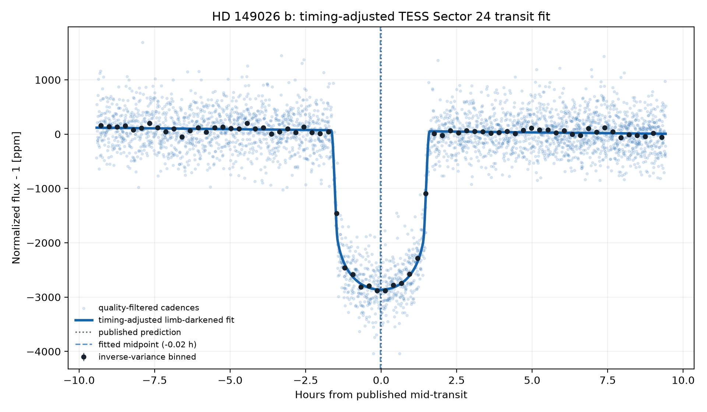
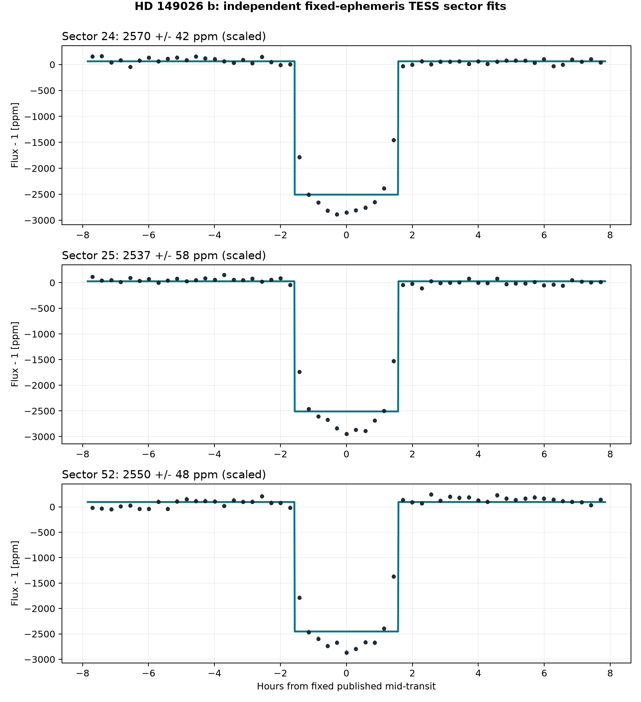
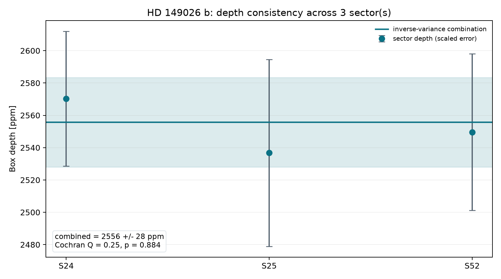
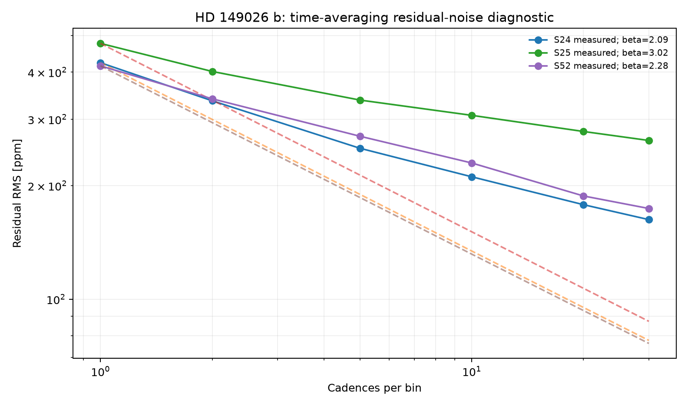

# HD 149026 b — Real TESS Transit Report

<p align="center">
  
</p>

One real, public TESS SPOC light curve; one saved NASA Exoplanet Archive
ephemeris; one reproducible flat-versus-box statistical comparison.

**[Open the full report](https://biswajit1999.github.io/hd149026b-exoplanet-report/)** — the live GitHub Pages version.

## Data sources

- **System parameters** — the saved `pscomppars` row from the [NASA Exoplanet Archive TAP service](https://exoplanetarchive.ipac.caltech.edu/TAP/sync?query=select+pl_name%2Chostname%2Cra%2Cdec%2Cpl_orbper%2Cpl_tranmid%2Cpl_trandur%2Cpl_rade%2Cpl_bmasse%2Cpl_eqt%2Cpl_orbsmax%2Csy_dist%2Csy_tmag%2Cst_teff%2Cst_rad%2Cst_mass%2Cdisc_year%2Cdiscoverymethod%2Cdisc_refname%2Cdisc_pubdate%2Cdisc_facility+from+pscomppars+where+pl_name%3D%27HD+149026+b%27&format=csv).
- **Observed photometry** — unmodified MAST file `tess2020106103520-s0024-0000000255930614-0180-s_lc.fits`, TESS Sector 24, DOI [10.17909/t9-nmc8-f686](https://doi.org/10.17909/t9-nmc8-f686). This is a real SPOC reduced light curve, not simulated data.
- Exact URLs, IDs, retrieval date, and SHA-256 checksum are in [`data/SOURCE.md`](data/SOURCE.md).

## Reproduce the analysis

```bash
pip install -r requirements.txt
python scripts/analyze_transit.py
python scripts/analyze_multisector.py
pytest tests/ -v
```

The script keeps finite `QUALITY == 0` cadences, normalizes `PDCSAP_FLUX`,
applies one symmetric robust outlier rule, and examines ±2.5 published transit
durations around the fixed NASA ephemeris. It compares a weighted constant with
a two-level box whose depth is fitted. Timing and duration are not searched.

## What the numbers show

| Quantity | Result |
|---|---:|
| TESS sector | 24 |
| Cadences in comparison | 2926 |
| Fitted box depth | 2570.3 ± 14.0 ppm |
| Flat χ² / dof / p | 39846.44 / 2925 / < 1e-300 |
| Box χ² / dof / p | 5950.36 / 2924 / 9.13e-209 |
| Improvement Δχ² / Δdof / p | 33896.08 / 1 / < 1e-300 |

The fixed-window box improves strongly on a flat light curve for these data. This establishes only how these archived fluxes compare with this
pre-specified box model. It does not independently confirm the planet or identify
an atmosphere.

<!-- MULTISECTOR-UPGRADE-START -->
## Multi-sector robustness and correlated noise

The fixed archive ephemeris was fitted independently in 3 usable sector(s) (S24, S25, S52). Formal depth errors were inflated by sqrt(max(reduced chi-square, 1)) times the residual time-averaging beta factor (observed range 2.09-3.02). The robust inverse-variance depth is 2555.8 +/- 27.7 ppm; Cochran Q = 0.25 for 2 dof (p = 0.8842). These scaled errors address underestimated scatter and short-timescale correlation, but they are not a full Gaussian-process or physical limb-darkened transit fit.

<p align="center"></p>

<p align="center"></p>

<p align="center"></p>

The per-sector table is in [`figures/multisector_statistics.csv`](figures/multisector_statistics.csv). Regenerate all three figures with `python scripts/analyze_multisector.py`.
<!-- MULTISECTOR-UPGRADE-END -->

## System context

- Radius: 8.29 Earth radii
- Mass: 120.78 Earth masses
- Orbital period: 2.875890 days
- Transit duration: 3.140 hours
- Semi-major axis: 0.0436 AU
- Equilibrium temperature: 1626 K
- Host: HD 149026 · distance 75.86 pc
- Discovery: 2005 by Radial Velocity (Subaru Telescope)

## Limitations

- A box is not a limb-darkened physical transit model and does not retrieve radius ratio, impact parameter, or stellar density.
- Period, mid-transit epoch, and duration are fixed to one NASA composite row; their uncertainties and transit-timing variations are not propagated.
- SPOC PDCSAP processing, crowding corrections, stellar variability, time-correlated noise, and underestimated point uncertainties can make absolute χ² p-values poor even when the relative comparison is informative.
- The χ² improvement uses one additional fitted depth parameter and no timing search. It is not a blind detection false-alarm probability, and nearby-star contamination is not ruled out.
- Published global fits combine sectors, instruments, detrending choices, limb darkening, and astrophysical priors. This deliberately smaller test does not replace them.

## Repository structure

```text
README.md
index.html
requirements.txt
data/                       unmodified TESS FITS + NASA row + SOURCE.md
scripts/analyze_transit.py  real-data analysis and figure generation
figures/                    generated plot + summary_statistics.csv
tests/                      real-data regression tests
.github/workflows/tests.yml CI on every push and pull request
LICENSE                     MIT
```

## References

1. [Sato et al. 2005](https://ui.adsabs.harvard.edu/abs/2005ApJ...633..465S/abstract) — discovery reference as listed by the NASA Exoplanet Archive.
2. Ricker, G. R. et al. (2015), *Transiting Exoplanet Survey Satellite (TESS)*, JATIS 1, 014003, [doi:10.1117/1.JATIS.1.1.014003](https://doi.org/10.1117/1.JATIS.1.1.014003).
3. TESS Team, *TESS Light Curves — All Sectors*, MAST, [doi:10.17909/t9-nmc8-f686](https://doi.org/10.17909/t9-nmc8-f686); Sector 24 used here.
4. [NASA Exoplanet Archive](https://exoplanetarchive.ipac.caltech.edu/), `pscomppars` TAP row retrieved 2026-08-15.

## Author

Biswajit Jana — [Portfolio](https://biswajit1999.github.io/Biswajit_Jana.github.io/) · [GitHub](https://github.com/Biswajit1999) · [LinkedIn](https://www.linkedin.com/in/biswajit-jana-27011a151/) · [ORCID](https://orcid.org/0009-0002-2411-1891)
